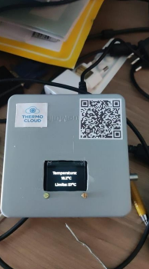
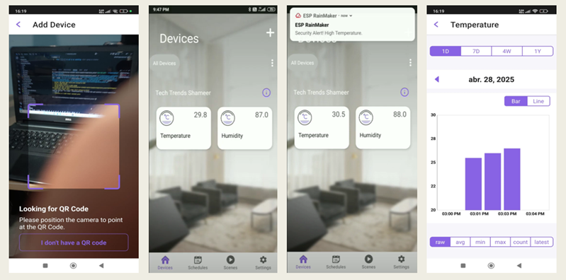
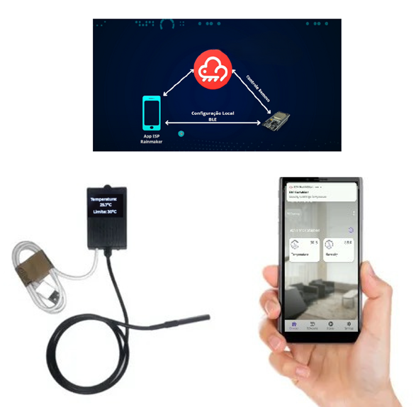

# 📡 Sistema de Monitoramento de Câmara Frigorífica em Nuvem

### **ESP32-S3 + DS18B20 + OLED + Encoder + ESP RainMaker**

Projeto desenvolvido como parte do curso de **Tecnologia em Sistemas Embarcados — FATEC Jundiaí**.

O sistema realiza monitoramento **em tempo real** da temperatura de câmaras frigoríficas, enviando as informações para a nuvem usando **ESP RainMaker**, possibilitando:

✔ Acesso remoto
✔ Dashboard no app
✔ Histórico de temperatura
✔ Ajuste de setpoint
✔ Alertas automáticos
✔ Exibição local no display OLED

---

# 🖼 Imagens do Projeto

### 📷 Aplicação pronta exibindo temperatura no display(Lendo o QrCode acessa ao App Esp RainMaker)

<p align="center">  </p>

### 📱 Funcionamento do aplicativo RainMaker

<p align="center">  </p>

### 🧊  produto final + celular

<p align="center">  </p>

---

# 🧭 Visão Geral

O sistema utiliza:

* **ESP32-S3 DevKitC-1**
* **Sensor DS18B20**
* **Display OLED I2C**
* **Encoder rotativo**
* **Plataforma ESP RainMaker (nuvem)**

A solução é indicada para:

🏪 Supermercados
🏥 Hospitais
🧪 Laboratórios
🚛 Transporte refrigerado
🥩 Açougues / Câmaras de carnes
💊 Farmácias

---

# 🏗 Arquitetura do Sistema

### 🔄 Fluxo de Dados

```
Sensor DS18B20  →  ESP32-S3  → Wi-Fi → ESP RainMaker → App Mobile
                          ↓
                      Display OLED
                          ↓
                    Encoder Rotativo
```

### 🧠 Principais Recursos

* Leitura contínua de temperatura
* Exibição local instantânea no display OLED
* Ajuste do setpoint pelo **encoder** ou pelo **app**
* Envio periódico para a nuvem
* Alertas automáticos
* Salvamento automático do limite na NVS
* Atualizações OTA habilitadas

---

# 🔌 Componentes Utilizados

### 📟 Hardware

| Componente         | Função                 |
| ------------------ | ---------------------- |
| ESP32-S3 DevKitC-1 | Processamento + Wi-Fi  |
| DS18B20            | Sensor digital OneWire |
| Display OLED 0.96" | Exibição local         |
| Encoder EC11       | Ajuste de limite       |
| Resistores 4.7kΩ   | Pull-up do DS18B20     |

### 🧰 Software

* ESP-IDF 5.x
* RainMaker SDK
* FreeRTOS
* LVGL
* VS Code

---

# 🛠 Montagem do Circuito

## 📌 DS18B20

| DS18B20 | ESP32  |
| ------- | ------ |
| DATA    | GPIO 4 |
| VCC     | 3.3V   |
| GND     | GND    |

Resistor 4.7kΩ entre **DATA ↔ 3.3V**

---

## 📌 OLED I2C

| OLED | ESP32   |
| ---- | ------- |
| SDA  | GPIO 36 |
| SCL  | GPIO 35 |
| VCC  | 3.3V    |
| GND  | GND     |

---

## 📌 Encoder Rotativo

| Encoder | ESP32   |
| ------- | ------- |
| A       | GPIO 12 |
| B       | GPIO 13 |
| COM     | GND     |

*(Se quiser, gero o esquema elétrico no Fritzing.)*

---

# 📁 Estrutura do Projeto

```
temperature_sensor/
│
├── CMakeLists.txt
├── README.md
├── partitions.csv
├── sdkconfig
├── imagens/
└── main/
    ├── app_main.c
    ├── CMakeLists.txt
    ├── idf_component.yml
    └── Kconfig.projbuild
```

---

# 🚀 Como Utilizar o Código (Passo a Passo)

## 1️⃣ Instale os pré-requisitos

* ESP-IDF 5.x
* VS Code + extensão ESP-IDF
* Python 3.8+
* Drivers USB do ESP32-S3

---

## 2️⃣ Clone o projeto

```
git clone https://github.com/<seu-repo>/temperature_sensor.git
```

---

## 3️⃣ Abra o projeto no VS Code

```
File → Open Folder → temperature_sensor
```

---

## 4️⃣ Configure o alvo

```
idf.py set-target esp32s3
```

---

## 5️⃣ Compile

```
idf.py build
```

---

## 6️⃣ Grave no ESP32

```
idf.py -p COM3 flash
```

---

## 7️⃣ Abra o monitor serial

```
idf.py monitor
```

Saída esperada:

```
Temperatura: 2.8°C
Limite: 5°C
Status: Normal
Dados enviados ao RainMaker
```

---

## 8️⃣ Configure no App ESP RainMaker

1. Abra o app
2. Clique em **Add Device**
3. Provisione na sua rede Wi-Fi
4. Espere a sincronização

O app mostrará:

✔ Temperatura
✔ Slider do setpoint
✔ Status (Normal / Alta)
✔ Histórico

---

## 9️⃣ Ajuste do Setpoint

### ⭕ Pelo encoder

Gire → atualiza o display → salva após 10s → sincroniza na nuvem

### 📱 Pelo app

Atualiza automaticamente no display.

---

## 🔥 1. Comportamento da temperatura

O firmware implementa um ciclo demonstrativo:

* Começa em 25°C
* Sobe até 99.5°C
* Depois desce até 0.5°C
* LED muda de cor conforme a temperatura (caso sua placa tenha RGB)

Se o LED não funcionar:

Use a configuração:

```
CONFIG_WS2812_LED_GPIO
```

---

## 🔄 Reset de Fábrica

Segure o botão **BOOT por 3 segundos**.

---

# 🧪 Testes Recomendados

### 🧊 Sensor no gelo

→ Temperatura baixa → status normal

### 🔥 Aquecer com a mão

→ Temperatura sobe → status pode mudar para "Alta"

### 📶 Desligar Wi-Fi

→ Dados armazenados e re-enviados ao reconectar

---


